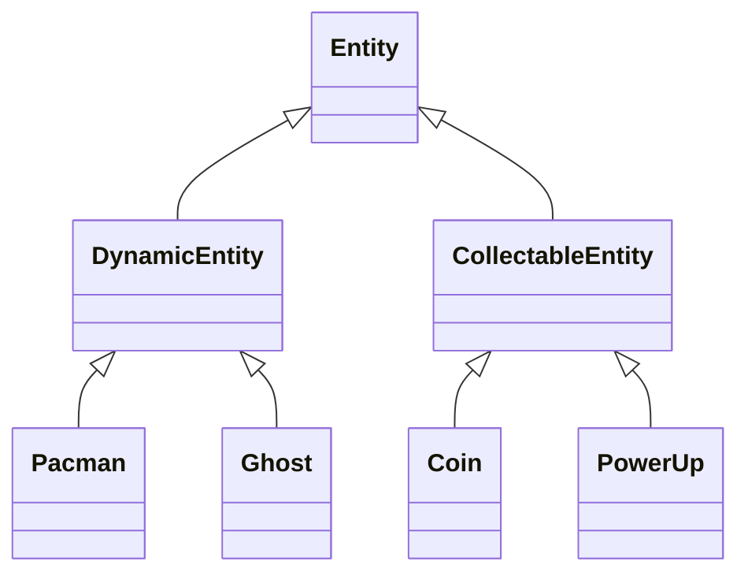
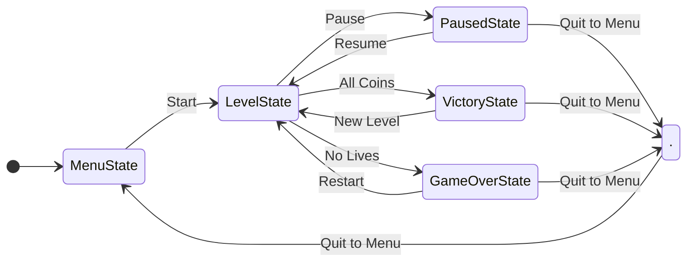
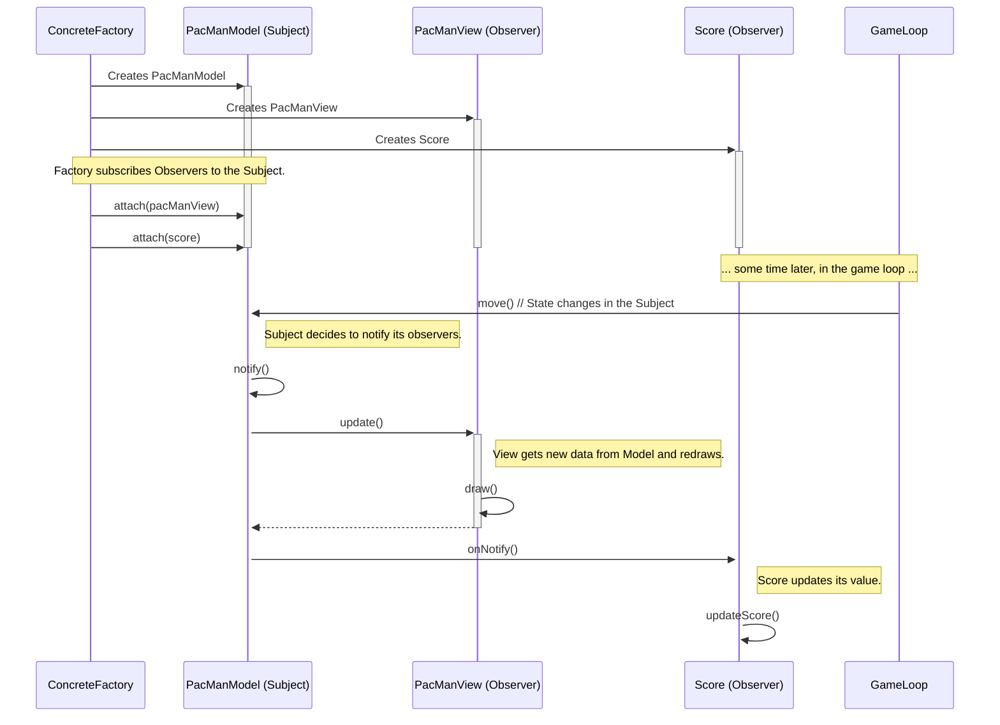

# Pacman
# Logic

### Entities

# Game States

The State System uses a stack-based StateManager to handle game flow transitions, where each state (Menu, Level, Pause, Victory, GameOver) manages its own transitions by pushing/popping new state objects onto the stack while maintaining clear separation between game logic and representation.

States control their own transitions and lifecycle, with LevelState creating fresh World instances for each level while persistent game data like score and lives is managed externally through observer systems.

# Factory
